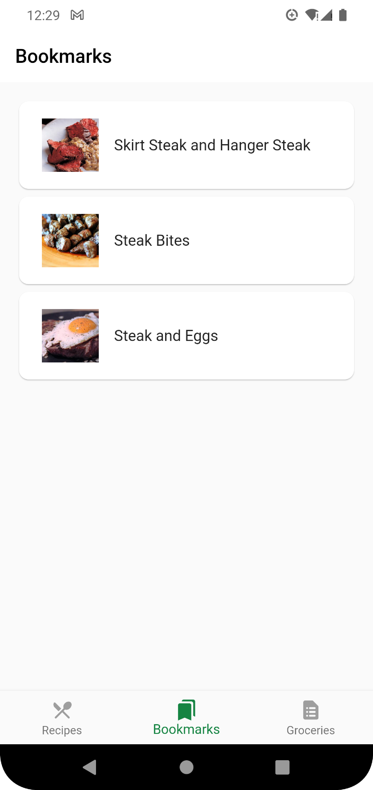

# recipe

A Flutter application that loads recipes from <a href="https://developer.edamam.com/" target="_blank">Edamam Recipe API</a>.

## User Interface

Steak Search:

Bookmarked recipes:

Saved ingredients:

